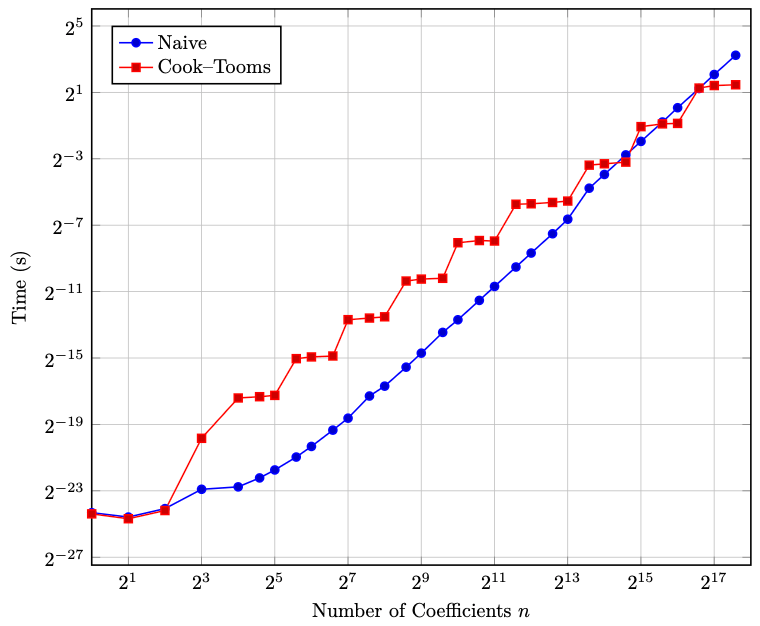
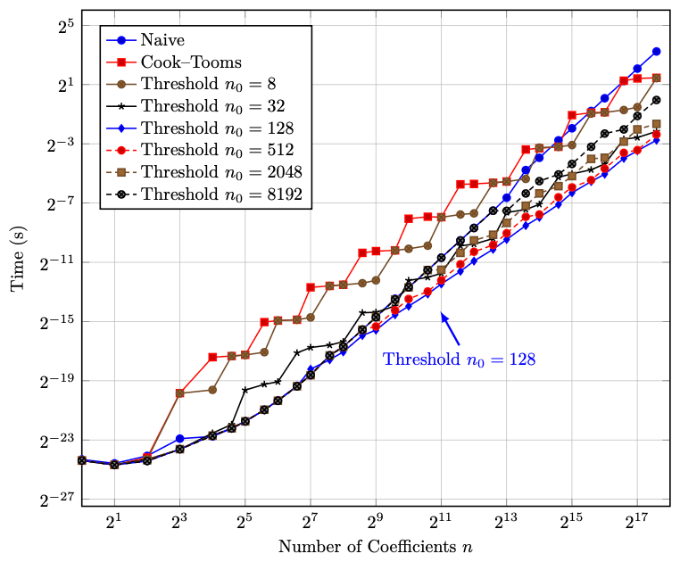

# HW4: Multiplying Polynomials

## Usage
Run with the release mode
```properties
cargo run --release
```

Test with
```properties
cargo test
```

## Implementation
Three polynomial multiplication algorithms are implemented:
1. Naive algorithm
2. Cook-Tooms algorithm
3. Thresholded Cook-Tooms algorithm

Internally, the Cook-Tooms algorithm is implemented as a special case of the thresholded version.
The threshold is set as 5 to keep the algorithm working in a simple way.
As such, any threshold equal or less than 5 will be the same as the Cook-Tooms algorithm.

## Results
Running Monte Carlo simulations on macOS with M1 chip, the following complexity (run time) analysis results are obtained:




*Plot generated using [`pgfplots`](https://tikz.dev/pgfplots/) and [`pgfplotstable`](https://tikz.dev/pgfplots/pgfplotstable) in LaTeX with the generated CSV data.*
